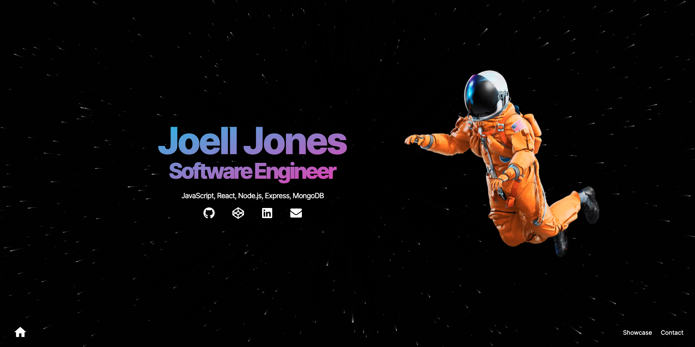

# Portfolio

> An Astro + Tailwind CSS portfolio page.

**Link to portfolio:** https://joelljones.github.io

## 🚀 How It's Made:

**Tech used:** [Astro](https://astro.build/), HTML, [Tailwind CSS](https://tailwindcss.com/), JavaScript

## Features

- 💨 Tailwind CSS for styling
- 🎨 Themeable
  - CSS variables are defined in `src/styles/theme.css` and mapped to Tailwind classes (`tailwind.config.cjs`)
- 🌙 Dark mode
- 📱 Responsive (layout, images, typography)
- ♿ Accessible (as measured by https://web.dev/measure/)
- 🔎 SEO-enabled (as measured by https://web.dev/measure/)
- 🔗 Open Graph tags for social media sharing
- 💅 [Prettier](https://prettier.io/) setup for both [Astro](https://github.com/withastro/prettier-plugin-astro) and [Tailwind](https://github.com/tailwindlabs/prettier-plugin-tailwindcss)

## 🧞 Commands

| Command                | Action                                            |
| :--------------------- | :------------------------------------------------ |
| `npm install`          | Install dependencies                              |
| `npm run dev`          | Start local dev server at `localhost:3000`        |
| `npm run build`        | Build your production site to `./dist/`           |
| `npm run preview`      | Preview your build locally, before deploying      |
| `npm run astro ...`    | Run CLI commands like `astro add`, `astro check`  |
| `npm run astro --help` | Get help using the Astro CLI                      |
| `npm run format`       | Format code with [Prettier](https://prettier.io/) |
| `npm run clean`        | Remove `node_modules` and build output            |

## Credits

- astronaut image
  - source: https://github.com/withastro/astro-og-image; note: this repo is not available anymore
- moon image
  - source: https://unsplash.com/@nasa
